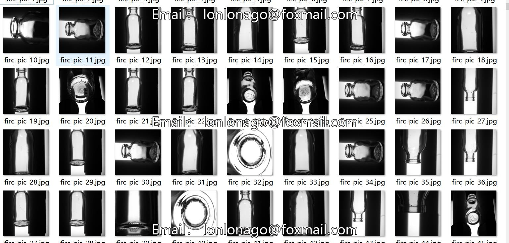
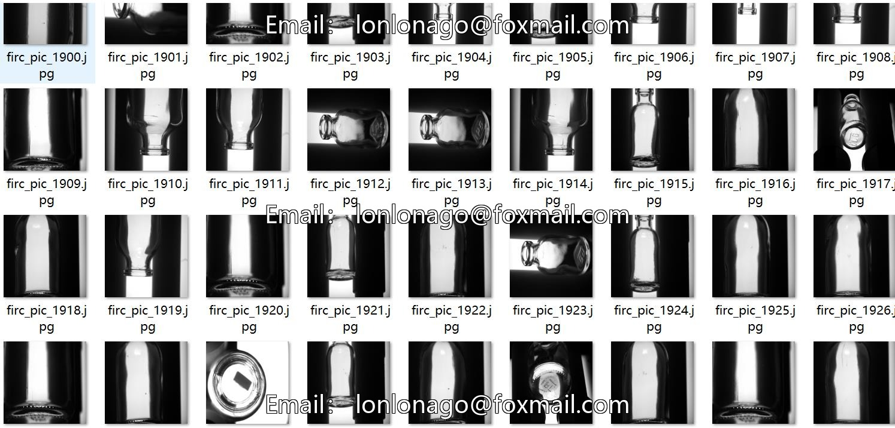
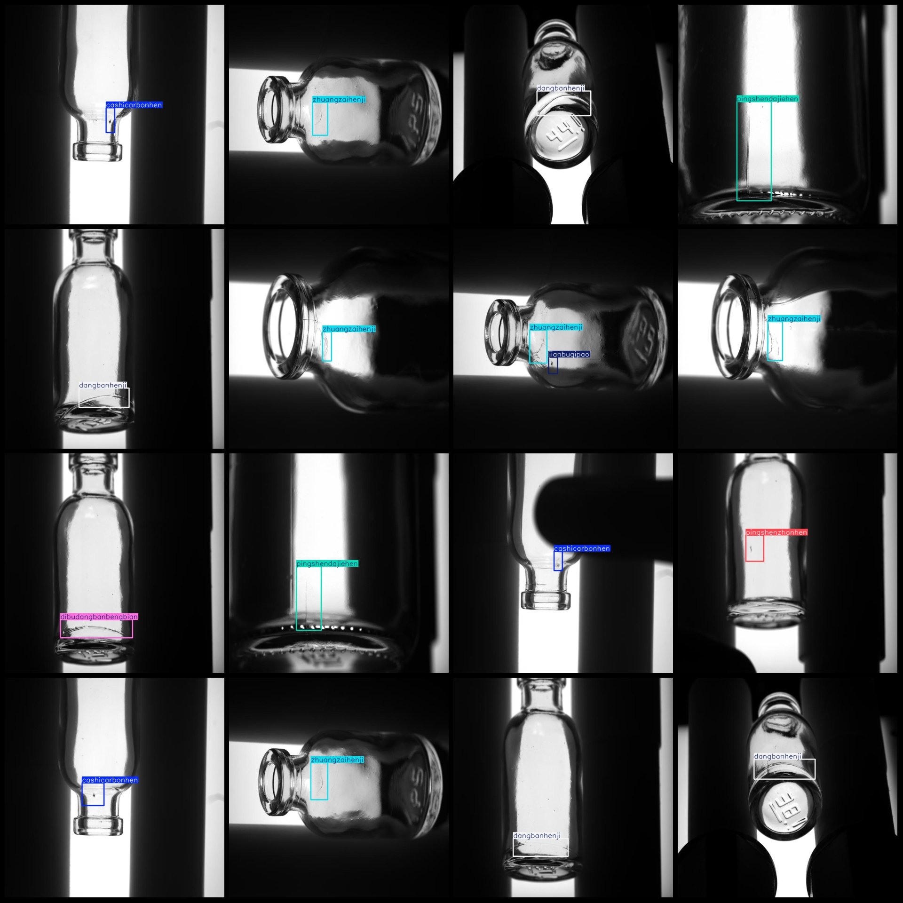
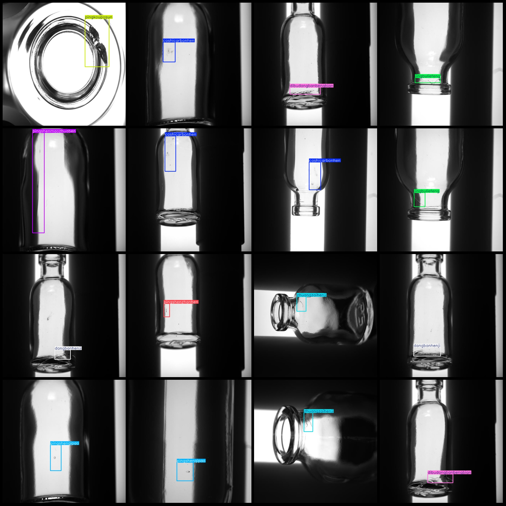

# Glass Bottle Defect Detection Data Set with VOC+YOLO Format and 2149 Images in 28 Categories

Dataset format: Pascal VOC format+YOLO format (without split path in txtfile, only containing jpg image and corresponding VOC format xmlfile and yolo format txtfile)
Number of images (total number of jpg files): 2149
Number of XML files: 2149
annotation count: 2149  
Category count: 28
["Scratch", "Plate mark", "Bottom plate edge chipping", "Bottom scratch", "Bottom crack", "Adhesive glass particles", "Black spot", "Scratch", "Shoulder crack", "Shoulder bubbling", "Shoulder brush marks", "Neck ring seam misalignment", "Neck crack", "Neck bubbling", "Neck brush marks", "Mold seam line", "Pulley mark", "Bottle mouth crack", "Bottle mouth splitting", "Bottle mouth damage", "Bottle mouth not filled", "Bottle body lap joint mark", "Bottle body scratch", "Bottle body cat scratch", "Bottle body bubble", "Bottle body sticker", "Tearing mark", "Loading mark"]
["Rust", "Plate marks", "Bottom plate chipping", "Bottom scratches", "Bottom cracks", "Adhesive glass particles", "Black spots", "Scratches", "Shoulder cracks", "Shoulder bubbles", "Shoulder brush marks", "Neck loop misalignment", "Neck cracks", "Neck bubbles", "Neck brush marks", "Mold seam line", "Pulley marks", "Bottle mouth cracks", "Bottle mouth splitting", "Bottle mouth damage", "Bottle mouth not filled", "Bottle body lap joint lines", "Bottle body scratches", "Bottle body cat scratches", "Bottle body bubbles", "Bottle body stickiness", "Tearing marks", "Loading marks"]
The number of boxes labeled in each category:
Wiping carbon traces box count = 323
Plate trace = 266
Bottom jamb edge chip box count = 116
Bottom scratch box count = 34
Bottom crack box count = 10
Adhesive glass particle box count = 30
Black spots = 30
Lesions on the box count = 34  
Lesions on the shoulder count = 50  
Lesions on the shoulder bubbles count = 57  
Lesions on the shoulder brush marks count = 30  
Lesions on the neck loop misalignment count = 108  
Lesions on the neck cracks count = 90  
Lesions on the neck bubbles count = 31  
Lesions on the neck brush marks count = 31  
Seam lines of the mould count = 72  
Leather stripe marks count = 72  
Cracks on the bottle mouth count = 9  
Cracks on the bottle mouth breakage count = 9  
Damages on the bottle mouth count = 37  
Empty spaces in the bottle mouth count = 50  
Fraying on the bottle body count = 10  
Scratches on the bottle body count = 37  
Cat scratches on the bottle body count = 177
The number of bubbles in the bottle body is 41.
Bottle body residue count = 177
The tear mark count = 190
Loading traces, box count = 15
total boxes: 2278  
images per class:   
Carbonaceous residues
Barcode Trace = 266
"Bottom baffle edge cracks, occupying 116 images."
Bottom scratches: 34 pictures
Bottom crack images = 10
Attached glass particles occupying picture counts = 30
Black spots occupy 30% of the image.
Scratches = 34
Breech in Shoulder = 50
Bubble in Shoulder = 57
Scratch on Shoulder = 30
Dislocated Ring in Neck = 108
Crack in Neck = 90
Bubbles in Neck = 31
Scratch in Neck = 31
Seam Line in Mold = 72
Pulse Marks = 72
Craze in Bottle Cap = 9
Crack in Bottle Cap = 9
Damage to Bottle Cap = 37
Bottle Cap not filled = 50
Overlapping in Bottle Body = 10
1. 37 images of scratches on the bottle body
2. 177 images of cat scratches on the bottle body
3. 41 images of bubbles on the bottle body
4. 177 images of adhesive residues on the bottle body
Tear images = 190
Loading traces images = 15
image resolution: 640x640
## Images

Here is a pay link on Stripe ( https://buy.stripe.com/3cs8yP7sY87d0vu9AB ). Please contact me lonlonago@foxmail.com after funding $89, and I will send you a complete data files , thank you!

